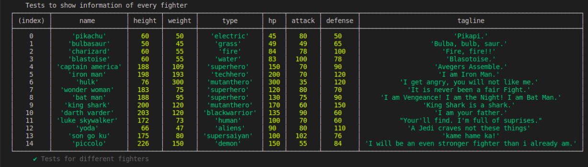
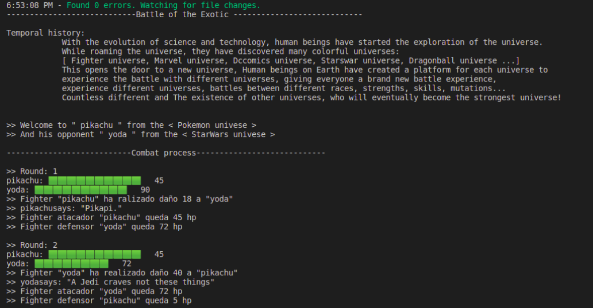
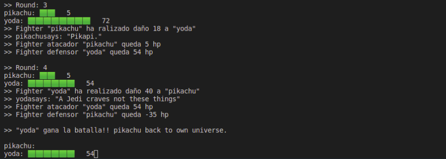
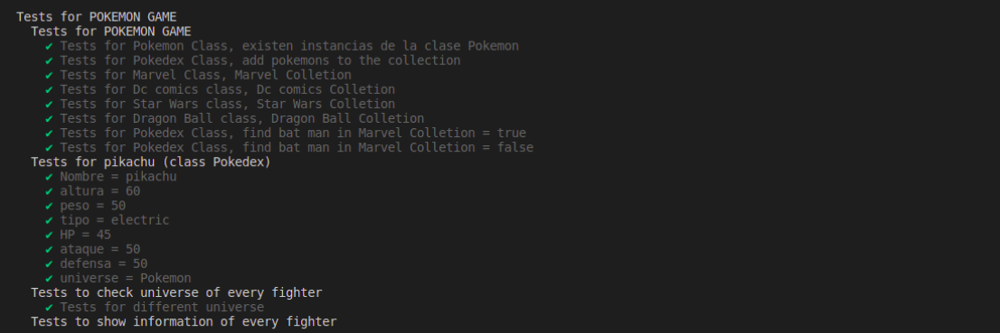
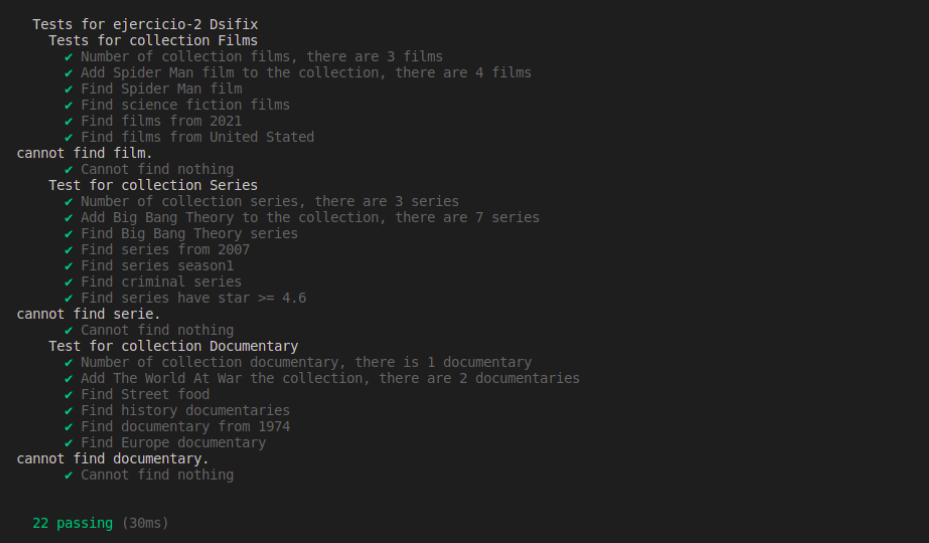
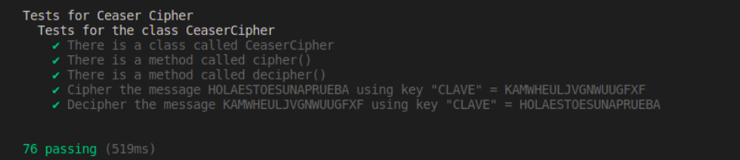

# Práctica 6 - Clases e interfaces genéricas. Principios SOLID

```
Autor: XueMei Lin
Curso: 2021- 2022
Universidad: Universidad de La laguna
Asignatura: Desarrollo de Sistemas Informaticos
Herramienta: Visual Studio Code
Lenguaje de programción: TypeScipt
```

## 1. Introducción
Como hemos mencionado antes, vamos a utilizar los principios de SOLID para profundizarnos el contenido sobre el lenguaje Typescript. Mediante los ejercicios, vamos a aprender más sobre:

1. Interfaces genéricas
2. Clases 


## 2. Objetivos
El objetivo de la practica 5, vamos a aprender como crear clases, y cómo a partir de una clases cómo crear un objeto de la clase. Además, en las clases vamos a crear atributos y métodos, con el fin de realizar una serie de ejercicios de programación que nos permitirán conocer más en profundidad los objetos, clases e interfaces del lenguaje TypeScript.

## 3. Ejercicios propuestas

### 3.1. Ejercicio 1 - El combate definitivo
1. La clase abstracta Figter (Para aplicar los principios)
2. Las subclases *Marvel*, *Pokemon*, *DcComics*, *DragonBall*, *StarWars* son heredas a la clase abstracta.
3. La clase *combat* realiza el proceso de combate entre dos fighters
4. La clase *pokedex* es una clase para guardar la colection de figheter

**Clase abstracta Figter**
```
/**
 * _abstract class Fighteer_
 */
export abstract class Fighter{
    
    protected status = {
        hp: 0,
        attack: 0,
        defence: 0,
    }   

    /**
     * _Constructor of fighter_
     * @param name fighter name
     * @param height fighter's height
     * @param weight fighter's weight
     * @param type fighter's type
     * @param hp fighter's hp
     * @param attack fighter's attack
     * @param defense fighter's defense
     * @param tagline fighter's tagline
     */
    constructor(private readonly name:string, private readonly height:number,
        private readonly weight:number, private readonly type:string, 
        private hp:number, private readonly attack:number, 
        private readonly defense:number, private readonly tagline:string) {
            this.name = name;
            this.height = height;
            this.weight = weight;
            this.type = type;
            this.hp = hp;
            this.attack = attack;
            this.defense = defense;
            this.tagline = tagline;
    }

    /**
     * _Get fighter's name_
     */
    getName() { return this.name; }

    /**
     * _Get fighter's height_
     */
    getHeight() { return this.height; }
    
    /**
     * _Get fighter's weight_
     */
    getWeight() { return this.weight; }

    /**
     * _Get fighter's type_
     */
    getType() { return this.type; }

    /**
     * _Get fighter's hp_
     */
    getHP() { return this.hp; }

    /**
     * _Get fighter's attack_
     */
    getAttack() { return this.attack; }

    /**
     * _Get fighter's defense_
     */
    getDefense() { return this.defense; }
    
    /**
     * _Get fighter's tagline_
     */
    getTagline() { return this.tagline; }
    
    /**
     * _Inserter new hp after combat_
     * @param Hp vida de cada fighter
     */
    public setHp(fighterHP:number) { this.status.hp = fighterHP; }

    /**
     * _Method that every fighter has different universe_
     */
    abstract getUniverse():string;

}
```
La clase abstractra está definiendo los `getters()` para obtener la informacion de cada fighter. Por el uso de los principios de SOLID. Hay una clase `showInfoFighter()` que realiza la mostracion de estas informaciones.

**CLass Print()**
```
import { Pokedex } from './pokedex';

/**
 * _Class showInfoFighter_
 */
export class showInfoFighter {
    constructor(private colletion:Pokedex) {
    }

    /**
     * _Method that use console.table to show information of fighter_
     */
    public showInfo() {
        console.table(this.colletion.getFighter(), ["name", "height", "weight", "type", "hp", "attack", "defense", "tagline"]);
    }
}
```
Dentro de la clase `showInfoFighter()`, hay un metodo llamado `showInfo()`, lo que hace es mostrar la infomacion usando la tabla. Como la siguiente:



**Una de las subclases**
```
import { Fighter } from './fighter'

/**
 * _Subclass DcComics_
 */
export class DcComics extends Fighter {

    private readonly universe:string = "DcComics";

    /**
     * _Constructor of fighter_
     * @param name fighter name
     * @param height fighter's height
     * @param weight fighter's weight
     * @param type fighter's type
     * @param hp fighter's hp
     * @param attack fighter's attack
     * @param defense fighter's defense
     * @param tagline fighter's tagline
     */
    constructor(name:string, height:number, weight:number, type:string, 
        hp:number, attack:number, defense:number, sentence:string) {
        super(name, height, weight, type, hp, attack, defense, sentence);
    }

    /**
     * _Method that to get fighter's universe_
     */
    getUniverse():string {
        return this.universe;
    }
}
```
Todas las subclases de la clase abstracta tiene la misma estructura que el ejemplo anterior.
El metodo `getUniverse()` es un metodo que obliga a implementar en las subclases. Lo que realiza es devolver el universo de cada `fighter`.


**Clase combat**
Donde realiza el combate entre dos fighters
```
import { Fighter } from "./fighter";
import { Pokemon } from "./pokemon";
import { Marvel } from "./marvel";
import { DcComics } from "./dccomics";
import { StarWars } from "./starwars";
import { DragonBall } from "./dragonball";

/**
 * _Class Combat_
 */
export class Combat {
    private fighter1:Fighter;
    private fighter2:Fighter;

    /**
     *  _Construtor of the class Combat_
     * @param fighter1 fighter1 (from one of 5 universes.)
     * @param fighter2 fighter2 (from one of 5 universes.)
     */
    constructor(fighter1:Fighter, fighter2:Fighter) {
        this.fighter1 = fighter1;
        this.fighter2 = fighter2;
    }

    /**
     * _Calcular el ataque de Fighter A hacia Fighter B_
     * @param fighter1 tipo de Fighter atacator
     * @param fighter2 tipo de Fighter defensor
     * @returns daño realizado por el defensor
     */
    private SepWorldWarGame(fighter1:Fighter, fighter2:Fighter):number{
        let efectiveness: number = 0;
        let damage_total: number = 0;

        switch(fighter1.getUniverse()) {

            // DragonBall > Marvel > DcComics > Fighter > StarWars 

            case 'Pokemon':
                if(fighter2 instanceof Pokemon) {
                    if(fighter1.getType() == fighter2.getType()){
                        efectiveness = 0.5;
                    }else{
                        switch(fighter1.getType()){

                            case "fire":
                                if(fighter2.getType() == "grass"){
                                    efectiveness = 2;
                                }else if(fighter2.getType() == "water"){
                                    efectiveness = 0.5;
                                }else{
                                    efectiveness = 1;
                                }
                            break;

                            case "water":
                                if(fighter2.getType() == "fire"){
                                    efectiveness = 0.5;
                                }
                                if(fighter2.getType() == "grass" || fighter2.getType() == "electric"){
                                    efectiveness = 2;
                                }
                            break;

                            case "grass":
                                if(fighter2.getType() == "fire"){
                                    efectiveness = 0.5;
                                }else if(fighter2.getType() == "electric"){
                                    efectiveness = 1;
                                }else{
                                    efectiveness = 2;
                                }
                            break;

                            case "electric":
                                if(fighter2.getType() == "fire" || fighter2.getType() == "grass"){
                                    efectiveness = 1;
                                }else{
                                    efectiveness = 2;
                                }
                            break;
                        }
                    }
                }    
            
                if(fighter2 instanceof Marvel) { efectiveness = 0.5; }
                if(fighter2 instanceof DcComics) { efectiveness = 0.5; }
                if(fighter2 instanceof StarWars) { efectiveness = 2; }
                if(fighter2 instanceof DragonBall) { efectiveness = 0.5; }

            case 'DragonBall':
                if(fighter2 instanceof Pokemon) { efectiveness = 2; }
                if(fighter2 instanceof Marvel) { efectiveness = 2; }
                if(fighter2 instanceof DcComics) { efectiveness = 2; }
                if(fighter2 instanceof StarWars) { efectiveness = 0.5; }
                if(fighter2 instanceof DragonBall) { efectiveness = 1; }
            break;

            case 'Marvel':
                if(fighter2 instanceof Pokemon) { efectiveness = 2; }
                if(fighter2 instanceof Marvel) { efectiveness = 1; }
                if(fighter2 instanceof DcComics) { efectiveness = 1; }
                if(fighter2 instanceof StarWars) { efectiveness = 2; }
                if(fighter2 instanceof DragonBall) { efectiveness = 0.5; }
            break;

            case 'DcComics':
                if(fighter2 instanceof Pokemon) { efectiveness = 2; }
                if(fighter2 instanceof Marvel) { efectiveness = 0.5; }
                if(fighter2 instanceof DcComics) { efectiveness = 1; }
                if(fighter2 instanceof StarWars) { efectiveness = 2; }
                if(fighter2 instanceof DragonBall) { efectiveness = 0.5; }
            break;

            case 'StarWars':
                if(fighter2 instanceof Pokemon) { efectiveness = 0.5; }
                if(fighter2 instanceof Marvel) { efectiveness = 0.5; }
                if(fighter2 instanceof DcComics) { efectiveness = 0.5; }
                if(fighter2 instanceof StarWars) { efectiveness = 1; }
                if(fighter2 instanceof DragonBall) { efectiveness = 2; }
            break;
        }

        damage_total = 50 * ( fighter1.getAttack() / fighter2.getDefense() ) * efectiveness;
        return Math.trunc(damage_total);
    }

    /**
     * _Metodo que realiza el proceso de combate_
     * @returns devuelve el ganador
     */
    public start() {
        console.log(`----------------------------Battle of the Exotic ----------------------------\n`);
        console.log(`Temporal history:    
            With the evolution of science and technology, human beings have started the exploration of the universe. 
            While roaming the universe, they have discovered many colorful universes:
            [ Fighter universe, Marvel universe, Dccomics universe, Starswar universe, Dragonball universe ...]
            This opens the door to a new universe, Human beings on Earth have created a platform for each universe to 
            experience the battle with different universes, giving everyone a brand new battle experience, 
            experience different universes, battles between different races, strengths, skills, mutations... 
            Countless different and The existence of other universes, who will eventually become the strongest universe!
        `);
        
        console.log(`\n>> Welcome to " ${this.fighter1.getName()} " from the < ${this.fighter1.getUniverse()} univese > `);
        console.log(`>> And his opponent " ${this.fighter2.getName()} " from the < ${this.fighter2.getUniverse()} univese >`);
        
        console.log(`\n---------------------------Combat process----------------------------`);

        let fighter1Hp:number = this.fighter1.getHP();
        let fighter2Hp:number = this.fighter2.getHP();
        let round:number = 1;
        
        while (fighter1Hp > 0 || fighter2Hp > 0) {
            let damage:number = 0;
            console.log(`\n>> Round: ${round}`);
            let printHp1:number = fighter1Hp / this.fighter1.getHP() * 10;
            process.stdout.write(`${this.fighter1.getName()}: `);
            for(let i = 0; i < printHp1; i++) {
                process.stdout.write(`🟩`);
            }
            process.stdout.write(`   ${fighter1Hp}`);

            let printHp2:number = fighter2Hp / this.fighter2.getHP() * 10;
            process.stdout.write(`\n${this.fighter2.getName()}: `);
            for(let i = 0; i < printHp2; i++) {
                process.stdout.write(`🟩`);
            }
            process.stdout.write(`   ${fighter2Hp}`);

            if(round % 2 != 0) {
                damage = this.SepWorldWarGame(this.fighter1, this.fighter2);
                console.log(`\n>> Fighter "${this.fighter1.getName()}" ha ralizado daño ` + damage + ` a "${this.fighter2.getName()}"`);
                console.log(`>> ${this.fighter1.getName()}says: "${this.fighter1.getTagline()}"`);
                fighter2Hp -= damage;
                console.log(`>> Fighter atacador "${this.fighter1.getName()}" queda ${fighter1Hp} hp`);
                console.log(`>> Fighter defensor "${this.fighter2.getName()}" queda ${fighter2Hp} hp`);
            }else{
                damage = this.SepWorldWarGame(this.fighter2, this.fighter1);
                console.log(`\n>> Fighter "${this.fighter2.getName()}" ha realizado daño ` + damage + ` a "${this.fighter1.getName()}"`);
                console.log(`>> ${this.fighter2.getName()}says: "${this.fighter2.getTagline()}"`);
                fighter1Hp -= damage;
                console.log(`>> Fighter atacador "${this.fighter2.getName()}" queda ${fighter2Hp} hp`);
                console.log(`>> Fighter defensor "${this.fighter1.getName()}" queda ${fighter1Hp} hp`);
            }
            if(fighter1Hp < 0) {
                console.log(`\n>> "${this.fighter2.getName()}" gana la batalla!! ${this.fighter1.getName()} back to own universe.`);
                
                process.stdout.write(`\n${this.fighter1.getName()}: `);
                
                let printHp2:number = fighter2Hp / this.fighter2.getHP() * 10;
                process.stdout.write(`\n${this.fighter2.getName()}: `);
                for(let i = 0; i < printHp2; i++) {
                    process.stdout.write(`🟩`);
                }
                process.stdout.write(`   ${fighter2Hp}`);

                return this.fighter2.getName();

            }else if(fighter2Hp < 0){
                console.log(`\n>> "${this.fighter1.getName()}" gana la batalla!! "${this.fighter2.getName()}" back to own universe.`);
                               process.stdout.write(`\n${this.fighter1.getName()}: `);
                
                let printHp1:number = fighter1Hp / this.fighter1.getHP() * 10;
                process.stdout.write(`\n${this.fighter2.getName()}: `);
                for(let i = 0; i < printHp1; i++) {
                    process.stdout.write(`🟩`);
                }
                process.stdout.write(`   ${fighter1Hp}`);

                return this.fighter1.getName();
            }else {
                round++;
            }
        }
    }
}
```
Por otro lado la clase de Combat donde realiza la batalla entre dos contrincantes.

Más concretamente, en la clase Combathe creado constructor `sepWorldWar()` donde compara el daño que realiza cada pokemon y un metodo `start()` que realiza el proceso de batalla.

En la funcion sepWorldWar tiene parametros fighter1 fighter2, son de tipo `Fighter`. Dependiendo de los tipos de fighter, el metodo calcula el daño realizado de uno a otro .

### 3.2. Ejercicio 2 - DSIflix

En este ejercicio consiste en implementar una interfaz genérica llamado `Streamable` y una clase abstracta `BasicStreamableCollection` y otras clases abstractas que vamos a ver en lo siguiente:

**Clase abstracta sobre BasicStreamableCollection**
```
import { StreamableSeach } from "./StreamableSeach";
import { Streamable } from './Streamable'

/**
 * Abstract class BasicStreamableCollection to include all Streamables
 */
export abstract class BasicStreamableCollection<T> implements StreamableSeach<T>, Streamable<T> {
    
    /**
     * _Constructor of the abstract class_
     * @param collection Array to save objects of type T
     */
    constructor(protected collection:T[]) {}

    /**
     * _Method that to add a object type T to the collection_
     * @param element elemento type T to add to the collection
     */
    addElement(element:T) { this.collection.push(element); }
    

    // Methods that should be implement in subclases;

    /**
     * _Method that to get element of the colletion_
     */
    abstract getElement():T[];


    /**
     * _Method that to seach type T with corresponding information_
     * @param data information that to seach
     * @param value value to seach
     */
    abstract searchElement(name:string, type:string):T[];

}
```
Es una clase abstracta, heredada la interfaz `Stramable`, tiene metodos `addElement()`, para añadir elemento de tipo generica a la colection. y los otros dos metodos deben ser implementados en las subclases.

**Interfaz de Stramable** :

```
export interface Streamable<T> {
    addElement(elemento:T):void;
    getElement():T[];
}
```

**Interfaz de StramableSeach** :
```
export interface StreamableSeach<T>{
    searchElement(type: string, name:string): T[];
}
```

**Realizar la busqueda sobre documentales**
```
import {BasicStreamableColletion} from './basicStreamableCollection';

/**
 * Definir la estructura de documento
 */
export type documento = {
    nombre: string;
    tipo: string;
}

/**
 * Clase Documentales
 */
export class Documentales extends BasicStreamableColletion<documento> {
    constructor(elementos: documento[]){
        super(elementos);
    }
    /**
     * Realizar la busqueda
     * @param tipo tipo de busqueda que quiere realizr
     * @param value el contenido que quiere buscar
     */
    busqueda(tipo:string, value:string):any{
        if(tipo == "nombre"){
            return this.collecion.filter((n) => (n.nombre == value));
        }else if(tipo == "tipo"){
            return this.collecion.filter((n) => (n.tipo == value));
        }else{
            return "No existe la documentacion que desea a buscar";
        }
    }
    /**
     * Funcion de imprimir el resultado
     */
    print(){
        this.collecion.forEach((tipo, value) => {
            console.log(`tipo que desea buscar: ${tipo}
                         nombre concreto que desea a buscar ${value}`);
        })
    }
}
```

**Realizar la busqueda sobre peliculas**

```
import {BasicStreamableColletion} from './basicStreamableCollection';

/**

 * Definir la estructura de pelicula
   */
   export type pelicula = {
   nombre: string;
   tipo: string;
   year: number;
   }

/**

 * Clase Peliculas
   */
   export class Peliculas extends BasicStreamableColletion<pelicula> {
   constructor(elementos: pelicula[]){
       super(elementos);
   }
   /**
    * Realizar la busqueda
    * @param tipo tipo de busqueda que quiere realizr
    * @param value el contenido que quiere buscar
      */
      busqueda(tipo:string, value:string):any{
      //switch(tipo.toLocaleUpperCase()){
          if(tipo == "nombre"){
              return this.collecion.filter((n) => (n.nombre == value));
          }else if(tipo == "tipo"){
              return this.collecion.filter((n) => (n.tipo == value));
          }else if(tipo == "year"){
              return this.collecion.filter((n) => n.year = Number(value));
          }else{
              return "No existe la pelicula que desea a buscar";
          }
      }
      /**
    * Funcion de imprimir el resultado
      */
      print(){
      this.collecion.forEach((tipo, value) => {
          console.log(`tipo que desea buscar: ${tipo}
                       nombre concreto que desea a buscar ${value}`);
      })
    }
 }
```

**Realizar la busqueda sobre series**

```
import {BasicStreamableCollection} from '../../src/ejercicio-2/BasicStreamableCollection'

/**
 * TypeSerie to describe informations of serie
 */
export type typeSerie = {
    title:string;
    year:number;
    season:number;
    star:number;
    type:string;
}

/**
 * Class Series to describe series collection
 */
export class Series extends BasicStreamableCollection<typeSerie> {

    constructor(private collectionSeries:typeSerie[]) {
        super(collectionSeries);
    }

    /**
     * _Method that to get series objects_
     * @returns series objects
     */
    getElement():typeSerie[]{
        return this.collectionSeries;
    }

    /**
     * _Method that to seach series with corresponding information_
     * @param data information that to seach
     * @param value value to seach
     */
    searchElement(data:string, value:string):typeSerie[]{
        let result:typeSerie[] = [];
        switch(data.toLowerCase()) {
            case ('title'):
                result = this.collectionSeries.filter((n) => n.title == value);
                break;
            case ('year'):
                result = this.collectionSeries.filter((n) => n.year == Number(value));
                break;
            case ('season'):
                result = this.collectionSeries.filter((n) => n.season == Number(value));
                break;
            case ('star'):
                result = this.collectionSeries.filter((n) => n.star >= Number(value));
                break;
            case ('type'):
                result = this.collectionSeries.filter((n) => n.type == value);
                break;
            default:
                console.log(`cannot find serie.`);
        }
        return result;
    }
}
```
Las subclases tiene la misma estructura, puesto que son subclases de la clase `BasicStreamable`, cada subclase tiene su propio tipo. Como por ejemplo: la clase `Films` tiene tipo `typeFilm` que tiene estructura del tipo lo siguiente:
```
export type typeFilm = {
    title:string;
    year:number;
    type:string;
    region:string;
}
```
y segun la estructura del tipo de cada clase, se realiza distinta forma de la busque, segun `nombre`, `año`, `temporada`, etc.

### 3.3. Ejercicio 3 - El cifrado indescifrable


***Clase CaesarCipher***

**Metodo cipher**
```
cipher(str:string, key:string):string {
        
        str = str.toLocaleUpperCase();
        let cipher = '';
        for(let i:number = 0, j:number = 0; i < str.length; i++, j++) {
            // let key repite N times
            if((i+1) % key.length == 0) {
                j = 0;
            }

            let newIndex:number = ((this.alphabet.indexOf(str[i])+1) + (this.alphabet.indexOf(key[j])+1));
            newIndex = newIndex % this.alphabet.length;
            cipher += this.alphabet[newIndex-1];
        }
        return cipher;
    }
```
El metodo `cipher()` recibe dos parametros, y dentro de la funcion va iterando por la posicion, haciendo la suma de cada posicion del mensaje y la posicion de la clave, se obtiene una nueva posicion que es el mensaje cifrado. 

**Metodo decipher**
```
decipher(str:string, key:string): string {
        str = str.toLocaleUpperCase();
        let decipher = "";
        for(let i:number = 0, j:number = 0; i < str.length; i++, j++) {
            if((i+1) % key.length == 0) {
                j = 0;
            }
            let newIndex:number = ((this.alphabet.indexOf(str[i])+1) - (this.alphabet.indexOf(key[j])+1));
            newIndex = (newIndex + this.alphabet.length) % this.alphabet.length;
            decipher += this.alphabet[newIndex-1];
        }
        return decipher;
    }
```

El metodo `decipher()` recibe dos parametros, y dentro de la funcion va iterando por la posicion, haciendo la resta de cada posicion del mensaje y la posicion de la clave, se obtiene una nueva posicion que es el mensaje descifrado. 


##  4. Conclusiones

En esta práctica, he aprendido más cosas que están relacionado con

## 5. Bibliografía
1. [Clases abstractas y interfaces](https://ifgeekthen.everis.com/es/clases-abstractas-e-interfaces)

2. [Relaciones de clases abstractas](https://qastack.mx/programming/597769/how-do-i-create-an-abstract-base-class-in-javascript)

3. [Clases y metodos](https://lenguajejs.com/javascript/caracteristicas/clases-es6/)

4. Apuntes de la clases


**JUEGO DE POKEMON**



 


**JUEGO DE CONECT4**






